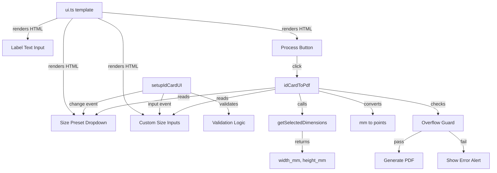

# Design Document: ID Card Size Presets

## Overview

This feature enhances the existing "ID Card to PDF" tool in BentoPDF by replacing the hardcoded IC card dimensions with a configurable preset system. Users will be able to select from predefined document sizes (IC, Passport) via a dropdown, or enter custom dimensions in millimetres. The selected dimensions drive the image scaling during PDF generation.

The implementation modifies two files:
- **`src/js/ui.ts`** — Adds the dropdown and custom input fields to the HTML template.
- **`src/js/logic/id-card-to-pdf.ts`** — Refactors the constant-based dimensions into a preset lookup, adds validation logic, and integrates overflow checking.

No new dependencies are required. The feature uses the existing pdf-lib library for PDF generation and standard DOM APIs for UI interaction.

## Architecture

The feature follows the existing BentoPDF pattern: a template in `ui.ts` renders static HTML, and a `setup` function in the logic module wires up event listeners after the template is mounted.



### Data Flow

1. User selects a preset or enters custom dimensions.
2. `setupIdCardUI` wires change/input events to show/hide custom fields and validate inputs.
3. On "Generate ID Card PDF" click, `idCardToPdf()` calls `getSelectedDimensions()` to resolve the final width/height in mm.
4. Dimensions are converted to points (× 2.8346).
5. Overflow check verifies the layout fits on A4 (with margins).
6. If valid, PDF is generated with the computed dimensions; otherwise an error alert is shown.

## Components and Interfaces

### 1. Preset Configuration (`SIZE_PRESETS`)

A constant map of preset definitions, replacing the old `IC_WIDTH_PT` / `IC_HEIGHT_PT` constants.

```typescript
interface SizePreset {
  label: string;      // Display text, e.g. "IC (85.60 × 53.98 mm)"
  width_mm: number;   // Width in millimetres
  height_mm: number;  // Height in millimetres
}

const SIZE_PRESETS: Record<string, SizePreset> = {
  ic: { label: 'IC (85.60 × 53.98 mm)', width_mm: 85.60, height_mm: 53.98 },
  passport: { label: 'Passport (125 × 88 mm)', width_mm: 125, height_mm: 88 },
  custom: { label: 'Custom', width_mm: NaN, height_mm: NaN },
};
```

### 2. Dimension Resolution (`getSelectedDimensions`)

```typescript
interface Dimensions {
  width_mm: number;
  height_mm: number;
}

function getSelectedDimensions(): Dimensions | null
```

Reads the dropdown value. If a named preset is selected, returns its dimensions. If "custom" is selected, reads and parses the input fields. Returns `null` if custom values are invalid (handled by validation disabling the button, so this is a safety fallback).

### 3. Validation (`validateCustomInputs`)

```typescript
function validateCustomInputs(): boolean
```

Called on `input` events for the custom width/height fields. Checks:
- Non-empty
- Numeric (parseable as float)
- Within range [10.00, 300.00]

Enables/disables the process button and shows/hides a validation message element.

### 4. Overflow Guard (`checkDimensionsFitA4`)

```typescript
function checkDimensionsFitA4(width_mm: number, height_mm: number): boolean
```

Converts mm to points, then checks:
- `(width_pt + 80) <= 595.28` (A4 width with 40pt margin each side)
- `(2 * height_pt + 30 + 80) <= 841.89` (two images + gap + 40pt margin top/bottom)

Returns `true` if the layout fits.

### 5. UI Setup (`setupIdCardUI`)

Enhanced to wire:
- `change` event on `#ic-size-preset` dropdown → toggles visibility of `#ic-custom-size-fields`, calls validation.
- `input` event on `#ic-custom-width` and `#ic-custom-height` → calls `validateCustomInputs()`.

### 6. Updated Template (in `ui.ts`)

The template for `'id-card-to-pdf'` gains:
- A `<select id="ic-size-preset">` with a `<label>` ("Document Size") placed before the label text input.
- A `<div id="ic-custom-size-fields" class="hidden">` containing two labelled number inputs for width and height.
- A `<p id="ic-custom-validation-msg" class="hidden">` for the validation error message.

## Data Models

### SizePreset

| Field      | Type   | Description                           |
|-----------|--------|---------------------------------------|
| label     | string | Human-readable option text            |
| width_mm  | number | Document width in millimetres         |
| height_mm | number | Document height in millimetres        |

### Dimensions (runtime)

| Field      | Type   | Description                                |
|-----------|--------|--------------------------------------------|
| width_mm  | number | Resolved width for current generation      |
| height_mm | number | Resolved height for current generation     |

### Constants (unchanged)

| Constant      | Value     | Description                         |
|--------------|-----------|-------------------------------------|
| A4_WIDTH     | 595.28    | A4 page width in points             |
| A4_HEIGHT    | 841.89    | A4 page height in points            |
| MM_TO_PT     | 2.8346    | Conversion factor: 1 mm = 2.8346 pt |
| PAGE_MARGIN  | 40        | Vertical/horizontal page margin     |
| IMAGE_GAP    | 30        | Gap between front and back images   |

### Validation Rules

| Rule              | Min   | Max    | Unit |
|------------------|-------|--------|------|
| Custom width     | 10.00 | 300.00 | mm   |
| Custom height    | 10.00 | 300.00 | mm   |
| Decimal places   | —     | 2      | —    |

## Correctness Properties

*A property is a characteristic or behavior that should hold true across all valid executions of a system — essentially, a formal statement about what the system should do. Properties serve as the bridge between human-readable specifications and machine-verifiable correctness guarantees.*

### Property 1: Preset dimensions are correctly converted to points

*For any* preset key in `SIZE_PRESETS`, resolving the dimensions and converting to points SHALL produce values equal to the preset's defined `width_mm * 2.8346` and `height_mm * 2.8346`, within floating-point tolerance (±0.01).

**Validates: Requirements 1.4, 1.5, 3.1**

### Property 2: Validation rejects all invalid custom inputs

*For any* string that is either empty, non-numeric, or represents a number outside the closed range [10.00, 300.00], the validation function SHALL return false (rejecting the input).

**Validates: Requirements 2.5**

### Property 3: Overflow check correctly identifies oversized dimensions

*For any* width and height in millimetres, the overflow check SHALL return false (rejecting) if and only if `(width_mm * 2.8346 + 80 > 595.28)` OR `(2 * height_mm * 2.8346 + 30 + 80 > 841.89)`.

**Validates: Requirements 3.4**

### Property 4: Preset resolution identity

*For any* named preset key (ic, passport), selecting that preset and calling `getSelectedDimensions()` SHALL return the exact `width_mm` and `height_mm` values defined in `SIZE_PRESETS` for that key.

**Validates: Requirements 1.4, 1.5, 1.6**

### Property 5: Custom values are preserved across preset switching

*For any* pair of valid custom width and height values (numbers in [10, 300]) entered by the user, switching from "Custom" to any named preset and back to "Custom" SHALL restore the previously entered values unchanged in the input fields.

**Validates: Requirements 2.6**

## Error Handling

| Scenario | Handling |
|----------|----------|
| Custom fields empty or non-numeric | Disable process button, show validation message "Please enter valid dimensions between 10 and 300 mm." |
| Custom value out of range (< 10 or > 300) | Same as above |
| Dimensions exceed A4 bounds | `showAlert('Size Too Large', 'The selected document size is too large to fit on an A4 page. Please choose smaller dimensions.')` — PDF not generated, user state preserved |
| Image embedding failure | Existing error handling in `idCardToPdf()` catch block — unchanged |
| Fewer than 2 files uploaded | Existing validation — unchanged |

The process button remains disabled until:
1. At least 2 image files are uploaded (existing behaviour), AND
2. The selected dimensions are valid (either a named preset is selected, or custom inputs pass validation).

## Testing Strategy

### Unit Tests

- Verify `getSelectedDimensions()` returns correct values for each preset.
- Verify `validateCustomInputs()` correctly accepts/rejects edge-case inputs (10, 300, 9.99, 300.01, empty, "abc", "12.345").
- Verify `checkDimensionsFitA4()` returns correct boolean for boundary cases.
- Verify mm-to-points conversion arithmetic.

### Property-Based Tests

Property-based testing is appropriate for this feature because:
- The validation and conversion functions are pure (or near-pure with DOM reads mockable).
- Input spaces are numeric ranges that benefit from random exploration.
- Universal properties (round-trip, range correctness) are clearly expressible.

**Library:** [fast-check](https://github.com/dubzzz/fast-check) (MIT license, TypeScript-native, widely used).

**Configuration:**
- Minimum 100 iterations per property test.
- Each test tagged with: `Feature: id-card-size-presets, Property {number}: {property_text}`

**Properties to implement:**
1. Preset conversion correctness (Property 1)
2. Invalid input rejection — non-numeric and out-of-range combined (Property 2)
3. Overflow check formula correctness (Property 3)
4. Preset resolution identity (Property 4)
5. Custom value preservation across switching (Property 5)

### Integration / Manual Tests

- Visual verification that the dropdown renders correctly and matches existing styling.
- Keyboard navigation order: dropdown → custom width → custom height → label text.
- Confirm switching presets updates next PDF generation without page reload.
- Confirm oversized-dimension error preserves user selections.
- Confirm generated PDF has correct physical dimensions when printed at 100%.
